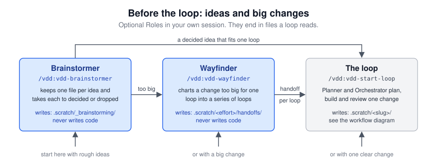

<div align="center">

# Vibe Driven Development

**Separate agent sessions that plan, review the plan, implement, and review the code. Each one grades the other's homework and never its own work.**

[](.claude-plugin/plugin.json)
[](LICENSE)
[](#-install)
[](#-install)
[](https://github.com/mattpocock/skills)

<picture>
  <source media="(prefers-color-scheme: dark)" srcset="docs/workflow-dark.svg">
  <source media="(prefers-color-scheme: light)" srcset="docs/workflow-light.svg">
  
</picture>

</div>

**tl;dr:** an opinionated wrapper around Matt Pocock's [skills](https://github.com/mattpocock/skills). It splits planning, plan review, implementation and code review across separate Claude Code / Codex / Cursor / GitHub Copilot CLI sessions that adversarially check each other's work.

> [!IMPORTANT]
> Matt Pocock's skill collection is a hard requirement: without it the Planner stops at its first handoff. See [Install](#-install).

## 📚 Contents

- [🎯 Why this works](#-why-this-works)
- [⚡️ Quickstart](#-quickstart)
- [🔌 Install](#-install)
- [🎛 Commands](#-commands)
- [🧪 Beta channel](#-beta-channel)
- [🔁 Workflow](#-workflow)
- [🧭 Before the loop](#-before-the-loop)

## 🎯 Why this works

A single agent session grades its own homework. It plans, implements and reviews with the same context and the same incentive to declare itself done. Splitting the work across separate sessions fixes that:

- **🧊 Fresh context.** The reviewer has not seen the planner's reasoning, so it has to verify claims against the actual codebase instead of nodding along.
- **🥊 Adversarial framing.** A session prompted to find problems finds problems. A session prompted to "implement and review" finds excuses.
- **📄 Written handoffs.** Forcing the spec, the implementation notes, and the review into files makes every claim checkable and keeps each session's context small.

The loop that comes out of this converges: plan, push back, revise, sign off, implement, push back, fix, sign off.

## ⚡️ Quickstart

Install the plugin and Matt Pocock's skills (see [Install](#-install)), then open a session in your repository and type:

```
/vdd:vdd-start-loop
```

In Codex, type `$vdd:vdd-start-loop` instead, and in Cursor `/vdd-start-loop`. GitHub Copilot CLI takes `/vdd:vdd-start-loop`, as Claude Code does. [Commands](#-commands) lists the commands you type on every agent.

That one command runs the environment check, walks you through anything the check finds missing, and starts the loop with you and the Planner.

VDD and the Matt Pocock skills create multiple working files along the way that are not gitignored by default (`docs/agents/`, `docs/adr/`, `CONTEXT.md`, appending to `AGENTS.md`/`CLAUDE.md`). If you'd rather keep them out of your history, you just can safely add them to `.gitignore` and/or prune the additions to your `AGENTS.md`/`CLAUDE.md`.

## 🔌 Install

VDD ships as a plugin from this repository's marketplace. Check the requirements, then open the section for your agent.

<details>
<summary><b>Requirements</b></summary>

- A repository to work in
- The ability to run two agent sessions side by side (two terminals is enough): the Planner, in your foreground, and the Orchestrator, which runs the rest.
- A coding agent with subagents. Claude Code, Cursor, Codex and GitHub Copilot CLI all have the primitive the Orchestrator needs to spawn the Plan-Reviewer, the Coder and the Code-Reviewer, each in a fresh context, and to resume the same one round after round. If your host asks for approval per command, grant session approval before you start the Workflow, so you are not answering prompts through the whole run.
- Matt Pocock's [skills](https://github.com/mattpocock/skills), the whole collection. In Claude Code: `/plugin install mattpocock-skills` (official marketplace). In Codex, Cursor, GitHub Copilot CLI and any other agent: `npx skills@latest add -g mattpocock/skills`, selecting your agent when it asks. The Roles borrow these:

  | Borrowed skill | Started by | Needed by |
  |----------------|-----------|-----------|
  | `setup-matt-pocock-skills` | 🧑 you | once per repository |
  | `grill-with-docs` | 🧑 you | Planner |
  | `improve-codebase-architecture` | 🧑 you | Planner |
  | `to-spec` | 🧑 you | Planner |
  | `to-tickets` | 🧑 you | Planner |
  | `wayfinder` | 🧑 you | Wayfinder |
  | `code-review` | 🤖 the agent | Code-Reviewer |
  | `writing-for-agents` | 🤖 the agent | Planner, Plan-Reviewer, Code-Reviewer |
  | `grilling` | 🤖 the agent | Brainstormer |

**Optional:** macOS or Linux, for the doorbell. In Claude Code, Codex, Cursor and GitHub Copilot CLI the Roles ring each other through the Doorbell file in `.scratch/<slug>/` instead of you copying a line between terminals, and also print the line, which you paste only if the other session does not wake. Everything works without a doorbell: the Roles print the line for you to paste.

</details>

<details>
<summary><b>Claude Code</b></summary>

```
/plugin marketplace add ArchitektApx/Vibe-Driven-Development
/plugin install vdd@vibe-driven-development
```

Start a new session in your repository and type `/vdd:vdd-setup`. Install Matt Pocock's collection from the official marketplace:

```
/plugin install mattpocock-skills
```

</details>

<details>
<summary><b>Codex</b></summary>

```
codex plugin marketplace add ArchitektApx/Vibe-Driven-Development
codex plugin add vdd@vibe-driven-development
```

Start a new Codex session in your repository with `codex --no-daemon`, so it picks up the plugin, and type `$vdd:vdd-setup`. Matt Pocock's plugin is Claude Code only, so install his collection with the skills CLI and select Codex when it asks which agents to install for:

```bash
npx skills@latest add -g mattpocock/skills
```

A Codex session cannot be woken by a background shell, so on Codex a waiting Role waits in a `Stop` hook. Setup installs it: after showing you the change, it copies the hook beside the Doorbell wait into `~/.local/share/vdd/` (or `$XDG_DATA_HOME/vdd/`) and adds a `Stop` entry to `~/.codex/hooks.json`. Codex runs no hook you have not trusted, so trust it in `/hooks` when Setup asks; that also turns it on in the session you are in.

> ⚠️ **Warning**
>
> Start every VDD session on Codex with `codex --no-daemon`, and resume one with `codex resume --no-daemon`. Since 0.158, plain `codex` runs its sessions in a shared background server, and quitting the terminal only disconnects you ("Any running work continues"). A quit Orchestrator then keeps running the Coder and the Code-Reviewer, spending tokens you do not see. `--no-daemon` keeps the session in your terminal, so quitting stops it.
>
> Apps that run Codex on their own app server, such as T3 Code, stop a session when you close it and need no flag.

To stop using VDD on Codex, delete the `Stop` entry that runs `vdd-codex-stop.sh` from `~/.codex/hooks.json`.

</details>

<details>
<summary><b>Cursor</b></summary>

Cursor installs the plugin for its IDE Agent and its CLI alike. Register the marketplace in a terminal:

```
agent plugin marketplace add https://github.com/ArchitektApx/Vibe-Driven-Development
```

Then run `/plugin` inside `agent` and install `vdd`.

Cursor also loads VDD you installed for Claude Code, as a plugin, or for Codex, from a skills directory. Type `/vdd` in Cursor first, and install only if nothing shows. Cursor lists every Role unprefixed, as `/vdd-<role>`. Install Matt Pocock's collection with the skills CLI and select Cursor when it asks which agents to install for:

```bash
npx skills@latest add -g mattpocock/skills
```

</details>

<details>
<summary><b>GitHub Copilot CLI</b></summary>

```
copilot plugin marketplace add ArchitektApx/Vibe-Driven-Development
copilot plugin install vdd@vibe-driven-development
```

Start `copilot` in your repository and type `/vdd:vdd-setup`. Install Matt Pocock's collection with the skills CLI and select GitHub Copilot when it asks which agents to install for:

```bash
npx skills@latest add -g mattpocock/skills
```

</details>

<details>
<summary><b>Other agents</b></summary>

Other agents can use the same skills via the [skills CLI](https://github.com/vercel-labs/skills):

```bash
npx skills@latest add -g ArchitektApx/Vibe-Driven-Development
npx skills@latest add -g mattpocock/skills
```

The agent must be able to spawn subagents, because the Orchestrator runs the Plan-Reviewer, the Coder and the Code-Reviewer as subagents of its own session.

The installer asks which skills to take and which agents to install them for. Take every `vdd-*` skill, and take all of Matt Pocock's collection: the Roles borrow from it, and installing the whole set lets `vdd-setup` verify your install without asking you to test it by hand. Pull updates later with `npx skills update -g`.

</details>

## 🎛 Commands

You type five commands yourself. Every other Role is started by the loop.

| Command | Claude Code | Codex | Cursor | Copilot CLI |
|---------|-------------|-------|--------|-------------|
| 🚀 Start a loop | `/vdd:vdd-start-loop` | `$vdd:vdd-start-loop` | `/vdd-start-loop` | `/vdd:vdd-start-loop` |
| 🧭 Orchestrator | `/vdd:vdd-orchestrator` | `$vdd:vdd-orchestrator` | `/vdd-orchestrator` | `/vdd:vdd-orchestrator` |
| 🩺 Environment check | `/vdd:vdd-setup` | `$vdd:vdd-setup` | `/vdd-setup` | `/vdd:vdd-setup` |
| 💡 Brainstormer | `/vdd:vdd-brainstormer` | `$vdd:vdd-brainstormer` | `/vdd-brainstormer` | `/vdd:vdd-brainstormer` |
| 🗺 Wayfinder | `/vdd:vdd-wayfinder` | `$vdd:vdd-wayfinder` | `/vdd-wayfinder` | `/vdd:vdd-wayfinder` |

Start a loop opens the Planner in your session. Open the Orchestrator in a second session when the Planner asks you to; it runs the rest of the loop. The environment check verifies that the borrowed skills are installed, the issue tracker is configured, the gitignore entries for `LOOP.md` and `.scratch/` exist, and no stale `LOOP.md` is left over from a previous loop. Starting a loop runs it for you, so run it by hand only to check a repository before its first loop. The Brainstormer and the Wayfinder are optional and come before the loop; see [Before the loop](#-before-the-loop).

<details>
<summary><b>Roles the loop starts for you</b></summary>

You do not type these. Start a loop opens the Planner, the Orchestrator hosts the Plan-Reviewer, the Coder and the Code-Reviewer as subagents, and it invokes the PR-Author at Sign-off.

| Role | Claude Code | Codex | Cursor | Copilot CLI |
|------|-------------|-------|--------|-------------|
| 🧠 Planner | `vdd:vdd-planner` | `vdd:vdd-planner` | `vdd-planner` | `vdd:vdd-planner` |
| 🔍 Plan-Reviewer | `vdd:vdd-plan-reviewer` | `vdd:vdd-plan-reviewer` | `vdd-plan-reviewer` | `vdd:vdd-plan-reviewer` |
| 💻 Coder | `vdd:vdd-coder` | `vdd:vdd-coder` | `vdd-coder` | `vdd:vdd-coder` |
| 🧪 Code-Reviewer | `vdd:vdd-code-reviewer` | `vdd:vdd-code-reviewer` | `vdd-code-reviewer` | `vdd:vdd-code-reviewer` |
| 🚢 PR-Author | `vdd:vdd-create-pr` | `vdd:vdd-create-pr` | `vdd-create-pr` | `vdd:vdd-create-pr` |

</details>

## 🧪 Beta channel

Want the most recent Roles and changes before they land on `master`? Install the [`beta` branch](https://github.com/ArchitektApx/Vibe-Driven-Development/tree/beta) instead. It carries the next release while it is tried on real loops, so a Role may still change there.

<details>
<summary><b>Claude Code</b></summary>

```
/plugin marketplace remove vibe-driven-development
/plugin marketplace add ArchitektApx/Vibe-Driven-Development@beta
/plugin install vdd@vibe-driven-development
```

Back to the release: run the same three commands without `@beta`. `/plugin marketplace update` pulls the latest beta.

</details>

<details>
<summary><b>Codex</b></summary>

```
codex plugin marketplace remove vibe-driven-development
codex plugin marketplace add ArchitektApx/Vibe-Driven-Development --ref beta
codex plugin add vdd@vibe-driven-development
```

Back to the release: the same three commands without `--ref beta`.

</details>

<details>
<summary><b>Cursor</b></summary>

In a terminal:

```
agent plugin marketplace remove vibe-driven-development
agent plugin marketplace add https://github.com/ArchitektApx/Vibe-Driven-Development --git-ref beta
```

Then run `/plugin` inside `agent` and install `vdd`. `--git-ref` pins the commit the branch had when you added it, and `update` does not move it, so for later beta commits run the same `remove` and `add`, then `/plugin` again. Back to the release: the same `remove`, the `add` without `--git-ref beta`, and `/plugin`.

</details>

<details>
<summary><b>GitHub Copilot CLI</b></summary>

GitHub Copilot CLI takes no branch option, so it installs the beta from a local clone. The clone's marketplace carries the release's name, so remove that marketplace first; `--force` uninstalls the installed `vdd` with it:

```
git clone --branch beta https://github.com/ArchitektApx/Vibe-Driven-Development <clone path>
copilot plugin marketplace remove --force vibe-driven-development
copilot plugin marketplace add <clone path>
copilot plugin install vdd@vibe-driven-development
```

For later beta commits:

```
git -C <clone path> pull
copilot plugin marketplace update vibe-driven-development
copilot plugin update vdd@vibe-driven-development
```

Back to the release: `copilot plugin marketplace remove --force vibe-driven-development`, then the two install commands under [Install](#-install).

</details>

## 🔁 Workflow

The loop runs in three phases: the Planner and the Plan-Reviewer argue the spec into shape, the Coder and the Code-Reviewer do the same with the code, and the PR-Author ships it. [**docs/VDD-WORKFLOW.md**](docs/VDD-WORKFLOW.md#-the-vibe-driven-development-workflow) walks a loop round by round, names what each Role reads, writes and rings, and carries the model recommendations and the tips that keep loops converging.

## 🧭 Before the loop

Two optional Roles come before the loop. Both run in your own session, outside any loop, and end in files, never in code. For one change you already understand, skip both and run `/vdd:vdd-start-loop`.

<div align="center">

<picture>
  <source media="(prefers-color-scheme: dark)" srcset="docs/before-the-loop-dark.svg">
  <source media="(prefers-color-scheme: light)" srcset="docs/before-the-loop-light.svg">
  
</picture>

</div>

| Role | Use it when | It leaves you with |
|------|-------------|--------------------|
| 💡 Brainstormer | you have more ideas than you can judge, or one you are unsure of | `.scratch/_brainstorming/`: one file per idea and an index, each idea talked through, tested or grilled until it is `decided` or `dropped` |
| 🗺 Wayfinder | a change is too big or too foggy for one loop | `.scratch/<effort>/handoffs/`: an overview and one handoff per loop, which that loop's Planner plans from |

Neither Role starts the next one. You carry a decided idea file to `/vdd:vdd-start-loop` or `/vdd:vdd-wayfinder` yourself, and the Wayfinder's `00-overview.md` ends with the prompt that starts each loop. [**docs/VDD-WORKFLOW.md**](docs/VDD-WORKFLOW.md#-before-the-loop) has the details.

---

<div align="center">

Built with its own workflow. Glossary in [`CONTEXT.md`](CONTEXT.md), decisions in [`docs/adr/`](docs/adr/), house rules in [`AGENTS.md`](AGENTS.md).

MIT · [ArchitektApx](https://github.com/ArchitektApx)

</div>
